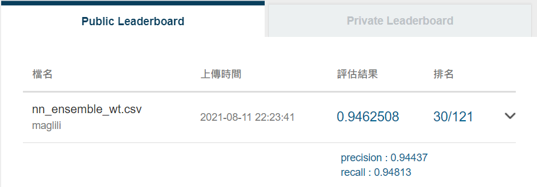
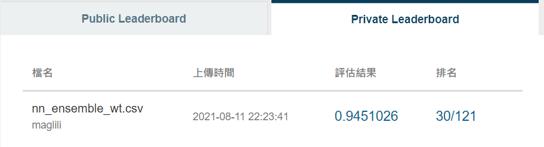

# AI-CUP

[](https://GitHub.com/Naereen/StrapDown.js/graphs/commit-activity)
[](https://github.com/psf/black)
[](https://shields.io/)
[](https://shields.io/)
[](https://shields.io/)

[](https://www.python.org/)
[](https://jupyter.org/try)
[](https://pytorch.org/)
[](https://git-scm.com/)

## Intro

[Problem link](https://aidea-web.tw/topic/c4a666bb-7d83-45a6-8c3b-57514faf2901)
Movie comments classification (sentiment analysis)

Train multiple different Bert model for stacking.

**Model list:**

1. bert-base-cased
2. roberta-base
3. xlnet-base-cased
4. google/electra-base-discriminator
5. microsoft/deberta-base
6. textattack/bert-base-uncased
7. aychang/roberta-base-imdb

**Project structure:**

```text
ai_cup-movie/
├── data
├── EDA.ipynb
├── GBDT_ensemble.ipynb
├── main.py
├── nn_ensemble.ipynb
├── pics
├── pytorchtools.py
├── readme.md
├── result
└── tools.py
```

**Public result:**



**Private result:**



## Workflow

1. EDA.ipynb: Data splitting and EDA
2. `main.py -m train`: Train bert model
3. `main.py -m prediction -sm`: Predict test data
4. `main.py -m l2 -sm`: Predict level 2 dataset(for stacking)
5. nn_ensemble.ipynb: Stacking

## RUN

**For argument detail:**

```bash
python main.py -h
```

### Policy 1: Train / Val / Test

Splitting dataset into train / validation / test set.
Here I only train 5 Bert model.

**Train:**

```bash
python main.py -m train -bs 8 -epo 10 --model_name bert-base-cased
python main.py -m train -bs 8 -epo 10 --model_name roberta-base
python main.py -m train -bs 8 -epo 10 --model_name xlnet-base-cased
python main.py -m train -bs 8 -epo 10 --model_name google/electra-base-discriminator
python main.py -m train -bs 4 -epo 10 --model_name microsoft/deberta-base
```

**Test:**

```bash
python main.py -m test -bs 8 -epo 10 --model_name bert-base-cased
```

<!-- **Level 2:**

```bash
python main.py -m l2 -bs 8 -epo 7 --model_name bert-base-cased
python main.py -m l2 -bs 8 -epo 10 --model_name roberta-base
python main.py -m l2 -bs 8 -epo 10 --model_name xlnet-base-cased
python main.py -m l2 -bs 8 -epo 10 --model_name google/electra-base-discriminator
python main.py -m l2 -bs 4 -epo 9 --model_name microsoft/deberta-base
``` -->

**Level 2(softmax):**

```bash
python main.py -m l2 -bs 8 -epo 7 --model_name bert-base-cased -sm
python main.py -m l2 -bs 8 -epo 10 --model_name roberta-base -sm
python main.py -m l2 -bs 8 -epo 10 --model_name xlnet-base-cased -sm
python main.py -m l2 -bs 8 -epo 10 --model_name google/electra-base-discriminator -sm
python main.py -m l2 -bs 4 -epo 9 --model_name microsoft/deberta-base -sm
```

<!-- **Predict for submission:**

```bash
python main.py -m predict -bs 8 -epo 7 --model_name bert-base-cased
python main.py -m predict -bs 8 -epo 10 --model_name roberta-base
python main.py -m predict -bs 8 -epo 10 --model_name xlnet-base-cased
python main.py -m predict -bs 8 -epo 10 --model_name google/electra-base-discriminator
python main.py -m predict -bs 4 -epo 9 --model_name microsoft/deberta-base
``` -->

**Predict for submission(softmax):**

```bash
python main.py -m predict -bs 8 -epo 7 --model_name bert-base-cased -sm
python main.py -m predict -bs 8 -epo 10 --model_name roberta-base -sm
python main.py -m predict -bs 8 -epo 10 --model_name xlnet-base-cased -sm
python main.py -m predict -bs 8 -epo 10 --model_name google/electra-base-discriminator -sm
python main.py -m predict -bs 4 -epo 9 --model_name microsoft/deberta-base -sm
```

### Policy 2: Data with Train / Val

Splitting dataset into train / validation set.

**Train:**

```bash
python main.py -m train -bs 8 -epo 10 --model_name bert-base-cased -wt
python main.py -m train -bs 8 -epo 10 --model_name roberta-base -wt
python main.py -m train -bs 8 -epo 10 --model_name xlnet-base-cased -wt
python main.py -m train -bs 8 -epo 10 --model_name google/electra-base-discriminator -wt
python main.py -m train -bs 4 -epo 10 -lr 2e-5 --model_name microsoft/deberta-base -wt
python main.py -m train -bs 8 -epo 10 -lr 4e-5 --model_name textattack/bert-base-uncased-imdb -wt
python main.py -m train -bs 8 -epo 10 -lr 4e-5 --model_name aychang/roberta-base-imdb -wt
```

**Level 2(softmax):**

```bash
python main.py -m l2 -bs 8 -epo 10 -lr 4e-5 --model_name bert-base-cased -wt -sm
python main.py -m l2 -bs 8 -epo 10 -lr 4e-5 --model_name roberta-base -wt -sm
python main.py -m l2 -bs 8 -epo 10 -lr 4e-5 --model_name xlnet-base-cased -wt -sm
python main.py -m l2 -bs 8 -epo 10 -lr 4e-5 --model_name google/electra-base-discriminator -wt -sm
python main.py -m l2 -bs 4 -epo 10 -lr 2e-5 --model_name microsoft/deberta-base -wt -sm
python main.py -m l2 -bs 8 -epo 10 -lr 4e-5 --model_name textattack/bert-base-uncased-imdb -wt -sm
python main.py -m l2 -bs 8 -epo 10 -lr 4e-5 --model_name aychang/roberta-base-imdb -wt -sm
```

**Predict for submission(softmax):**

```bash
python main.py -m predict -bs 8 -epo 10 -lr 4e-5 --model_name bert-base-cased -wt -sm
python main.py -m predict -bs 8 -epo 10 -lr 4e-5 --model_name roberta-base -wt -sm
python main.py -m predict -bs 8 -epo 10 -lr 4e-5 --model_name xlnet-base-cased -wt -sm
python main.py -m predict -bs 8 -epo 10 -lr 4e-5 --model_name google/electra-base-discriminator -wt -sm
python main.py -m predict -bs 4 -epo 10 -lr 2e-5 --model_name microsoft/deberta-base -wt -sm
python main.py -m predict -bs 8 -epo 10 -lr 4e-5 --model_name textattack/bert-base-uncased-imdb -wt -sm
python main.py -m predict -bs 8 -epo 10 -lr 4e-5 --model_name aychang/roberta-base-imdb -wt -sm
```

### Policy 3: Train / Val,  final model

Splitting dataset into train / validation set,
and train the final model with best hyper-parameter(without validation set).

**Re-train:**

```bash
python main.py -m retrain -bs 8 -epo 2 -lr 4e-5 --model_name bert-base-cased -wt -com
python main.py -m retrain -bs 8 -epo 3 -lr 4e-5 --model_name roberta-base -wt -com
python main.py -m retrain -bs 8 -epo 4 -lr 4e-5 --model_name xlnet-base-cased -wt -com
python main.py -m retrain -bs 8 -epo 2 -lr 4e-5 --model_name google/electra-base-discriminator -wt -com
python main.py -m retrain -bs 4 -epo 1 -lr 2e-5 --model_name microsoft/deberta-base -wt -com
python main.py -m retrain -bs 8 -epo 1 -lr 4e-5 --model_name textattack/bert-base-uncased-imdb -wt -com
python main.py -m retrain -bs 8 -epo 2 -lr 4e-5 --model_name aychang/roberta-base-imdb -wt -com
```

**Level 2(softmax):**

```bash
python main.py -m l2 -bs 8 -epo 2 -lr 4e-5 --model_name bert-base-cased -wt -com -sm
python main.py -m l2 -bs 8 -epo 3 -lr 4e-5 --model_name roberta-base -wt -com -sm
python main.py -m l2 -bs 8 -epo 4 -lr 4e-5 --model_name xlnet-base-cased -wt -com -sm
python main.py -m l2 -bs 8 -epo 2 -lr 4e-5 --model_name google/electra-base-discriminator -wt -com -sm
python main.py -m l2 -bs 4 -epo 1 -lr 2e-5 --model_name microsoft/deberta-base -wt -com -sm
python main.py -m l2 -bs 8 -epo 1 -lr 4e-5 --model_name textattack/bert-base-uncased-imdb -wt -com -sm
python main.py -m l2 -bs 8 -epo 2 -lr 4e-5 --model_name aychang/roberta-base-imdb -wt -com -sm
```

**Predict for submission(softmax):**

```bash
python main.py -m predict -bs 8 -epo 2 -lr 4e-5 --model_name bert-base-cased -wt -com -sm
python main.py -m predict -bs 8 -epo 3 -lr 4e-5 --model_name roberta-base -wt -com -sm
python main.py -m predict -bs 8 -epo 4 -lr 4e-5 --model_name xlnet-base-cased -wt -com -sm
python main.py -m predict -bs 8 -epo 2 -lr 4e-5 --model_name google/electra-base-discriminator -wt -com -sm
python main.py -m predict -bs 4 -epo 1 -lr 2e-5 --model_name microsoft/deberta-base -wt -com -sm
python main.py -m predict -bs 8 -epo 1 -lr 4e-5 --model_name textattack/bert-base-uncased-imdb -wt -com -sm
python main.py -m predict -bs 8 -epo 2 -lr 4e-5 --model_name aychang/roberta-base-imdb -wt -com -sm
```

## Reference

1. [BERT Fine-Tuning Tutorial with PyTorch](https://mccormickml.com/2019/07/22/BERT-fine-tuning/#a2-weight-decay)
2. [BERT Word Embeddings Tutorial](https://mccormickml.com/2019/05/14/BERT-word-embeddings-tutorial/)
3. [Cross validation strategy when blending/stacking](https://www.kaggle.com/general/18793)
4. [Complete Machine Learning Guide to Parameter Tuning in Gradient Boosting (GBM) in Python](https://www.analyticsvidhya.com/blog/2016/02/complete-guide-parameter-tuning-gradient-boosting-gbm-python/)
5. [4 Boosting Algorithms You Should Know – GBM, XGBoost, LightGBM & CatBoost](https://www.analyticsvidhya.com/blog/2020/02-boosting-algorithms-machine-learning/)
